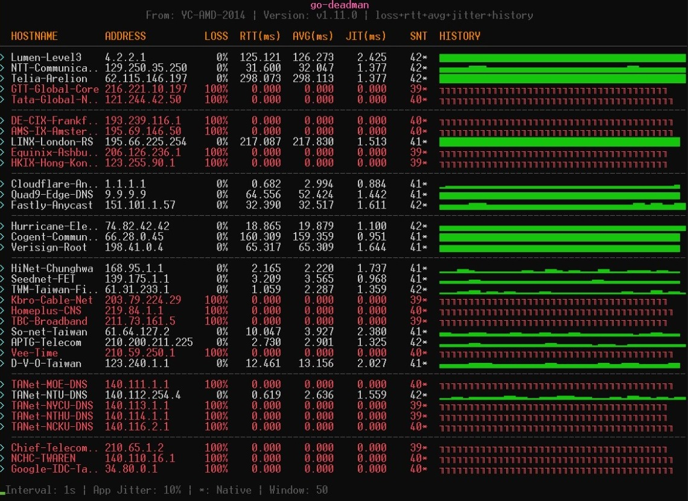

# go-deadman 💀


A high-performance, event-driven Terminal UI (TUI) application for monitoring network latency, jitter, and packet loss via ICMP ping. Built with Go, [Bubble Tea](https://github.com/charmbracelet/bubbletea), and [pro-bing](https://github.com/prometheus-community/pro-bing).


Source reference: [upa/deadman](https://github.com/upa/deadman)


## ✨ Features

* **Beautiful TUI**: Built with Bubble Tea and Lipgloss for a clean, responsive terminal interface.
* **Event-Driven & Socket Reuse**: Uses an infinite-send mode with socket reuse for highly efficient, continuous ICMP monitoring.
* **Real-time Metrics**: Calculates RTT, Average RTT, Jitter, and Packet Loss rate on the fly.
* **Visual History**: Displays a sparkline-style history of pings (`·`, `▄`, `▆`, `█`) based on the logarithmic ratio of current RTT to Average RTT.
* **Smart Fallback**: Automatically falls back to the OS-native `ping` command if raw socket privileges are unavailable (indicated by an absence of the `*` tag).
* **Auto DNS Resolution**: Automatically resolves hostnames to IPs and vice versa if only one is provided.
* **Customizable Interval & Jitter**: Configure polling intervals and artificial jitter for native fallback via YAML.

## 🚀 Installation

### Prerequisites
* Go 1.21 or higher.

### Build from Source

1. Clone the repository:
   ```bash
   git clone [https://github.com/yourusername/go-deadman.git](https://github.com/yourusername/go-deadman.git)
   cd go-deadman
   ```

2. **Important**: The application uses Go's `//go:embed` to bundle the configuration file into the binary. Ensure you have a `config.yaml` file in the root directory before building (you can rename the provided `internet.yaml` to `config.yaml`).
   ```bash
   cp internet.yaml config.yaml
   ```

3. Build the binary:
   ```bash
   go build -o go-deadman main.go
   ```

## ⚙️ Configuration

Configuration is managed via a YAML file (`config.yaml`). Here is an example structure:

```yaml
interval: 1s
jitter: 0.1
devices:
  - name: "Google-Cloud-DNS"
    ip: "8.8.8.8"
  - name: "Cloudflare-Anycast"
    ip: "1.1.1.1"
  - name: "HiNet-Chunghwa"
    ip: "168.95.1.1"
```

* `interval`: The base delay between pings (e.g., `1s`, `500ms`).
* `jitter`: Artificial jitter applied to the interval when running in OS-native fallback mode.
* `devices`: A list of targets to monitor. You can provide an `ip`, a `name`, or both.

*(See the included `internet.yaml` for a comprehensive list of global ISPs, CDNs, IXPs, and Taiwan-specific network targets.)*

## 💻 Usage

Run the compiled executable:

```bash
./go-deadman
```

To exit the application, press `q` or `Ctrl+C`.

### Privileges for ICMP (Raw Sockets)
For maximum performance and to use the native Go ping implementation, `go-deadman` requires raw socket privileges:

* **Linux**: Run with `sudo`, or grant the binary `cap_net_raw` capabilities:
    ```bash
    sudo setcap cap_net_raw=+ep go-deadman
    ```
* **Windows**: Run the executable as an Administrator.
* **macOS**: Usually requires running with `sudo`.

*Note: If privileges are not granted, the app will gracefully fall back to parsing your system's native `ping` command output.*

## 📊 Understanding the Dashboard

* **LOSS**: Packet loss percentage.
* **RTT(ms)**: Round-trip time of the most recent packet.
* **AVG(ms)**: Moving average RTT over the configured window size.
* **JIT(ms)**: Network jitter (variance in latency) over the window size.
* **SNT**: Total number of packets sent.
* **Tag (`*`)**: A `*` next to the sent count indicates the target is using the high-performance native Go ping. If missing, it's using the OS command fallback.
* **LOG-STATUS**: A visual representation of recent pings. Taller blocks (`█`) indicate higher latency spikes relative to the average, while `·` indicates a dropped packet or a timeout.

## 📄 License

This project is licensed under the MIT License - see the LICENSE file for details.
